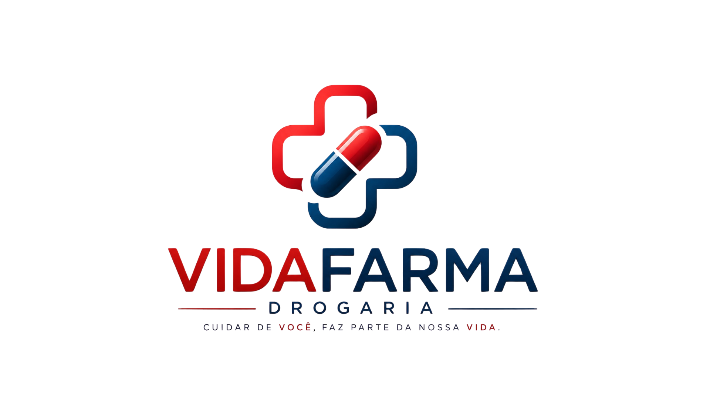

# 💊 Drogaria VidaFarma 

  

Sistema CRUD acadêmico desenvolvido para auxiliar no controle de medicamentos de uma drogaria, permitindo o gerenciamento de produtos, controle de validade e organização do estoque.

Projeto desenvolvido para a disciplina Back-End e Frameworks.

## 👨‍💻 Integrantes
- Gabriel Cristovão
- Maria Eduarda
- Yure Gabriel

## 📌 Sobre o projeto
O **VidaFarma Drogaria** foi criado com o objetivo de simular um sistema real de gerenciamento farmacêutico, oferecendo funcionalidades essenciais para controle de medicamentos e estoque.

O sistema permite:

- Cadastro de medicamentos
- Edição de produtos
- Exclusão de registros
- Controle de estoque
- Visualização de medicamentos vencidos
- Busca de produtos
- Organização das informações farmacêuticas

Além de ser um CRUD acadêmico, o projeto busca resolver uma necessidade real presente em pequenas drogarias e farmácias.

## 💡 Objetivo acadêmico

Este projeto foi desenvolvido como atividade da disciplina Back-End e Frameworks, com foco na prática de:

- Desenvolvimento Back-End
- Integração com banco de dados
- Estruturação de sistemas CRUD
- Organização de rotas e lógica de negócio
- Aplicação de frameworks no desenvolvimento web